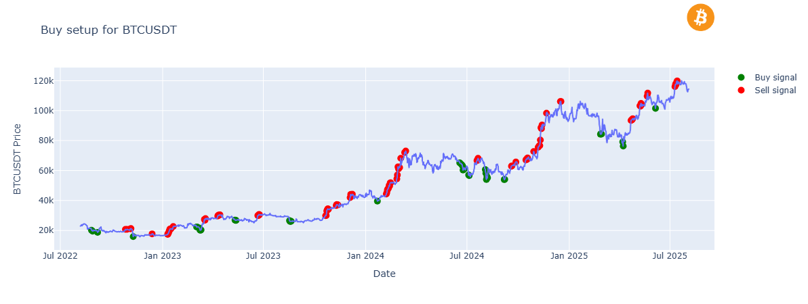

# 📈 Crypto Metrics Analysis & Strategy Backtesting

This repository provides a Python-based framework for analyzing cryptocurrency market data and simulating investment strategies using technical indicators such as **RSI**, **MACD**, **Bollinger Bands**, and **correlation with U.S. Treasury Rates**. The system generates buy/sell signals, allowing users to simulate trading strategies and evaluate performance.



---

## 📦 Features

* **Technical Indicator Calculation:**

  * Relative Strength Index (RSI)
  * Bollinger Bands
  * MACD (Moving Average Convergence Divergence)
  * Correlation with Treasury Rates
  * Volatility analysis
  * Trendline construction

* **Buy/Sell Signal Generation:**

  * Weighted decision-making logic based on multiple indicators
  * Customizable threshold levels for signals

* **Backtesting Simulator:**

  * Trader mode: Buys and sells based on signal logic
  * Buyer mode: Buys based on signal logic but holds until the end

* **Real-time Data Integration:**

  * Historical price data via the Binance API
  * U.S. Treasury rate data via a custom loader

* **Interactive Jupyter Notebook for analysis and simulation**

---

## 📁 Project Structure

```
.
.
├── src/
│   ├── get_historical_data.py         # Fetch historical data from Binance
│   ├── get_treasury_rate.py           # Load U.S. Treasury rate data
│   ├── crypto_metrics.py              # Core CryptoMetrics class
│   ├── simulations.py                 # Trade simulation logic
│   └── setup_binance.py               # Binance API client setup
│
├── analysis.ipynb                     # Jupyter notebook for simulation & results
├── README.md

```

---

## 🧠 Core Class: `CryptoMetrics`

Located in `src/metrics.py`, the `CryptoMetrics` class includes methods to calculate:

| Method                        | Description                                               |
| ----------------------------- | --------------------------------------------------------- |
| `calculate_rsi()`             | Computes RSI and buy/sell signals                         |
| `calculate_corr_treasury()`   | Correlation between coin price and treasury rate          |
| `calculate_bollinger_bands()` | Standard Bollinger Band indicators                        |
| `calculate_macd()`            | MACD and signal crossover logic                           |
| `calculate_trendline()`       | Weekly high/low data for plotting                         |
| `calculate_volatility()`      | Rolling volatility computation                            |
| `set_buy()`                   | Aggregates signals with weighted logic to define buy/sell |

---

## 🧪 Backtesting Simulation

The `simulate_model_trader()` and `simulate_model_buyer()` functions (in `simulator.py`) simulate two different strategies:

* **Trader Mode:** Buys when a buy signal is triggered and sells all holdings on a sell signal.
* **Buyer Mode:** Buys on a buy signal and holds until the end (no sell action).

Each function returns a detailed summary:

```python
{
  "initial_capital": 1000.0,
  "coin_holdings": 0.01567,
  "coin_holdings_dollars": 1025.63,
  "total_invested": 900.00,
  "final_balance": 1100.63
}
```

---

## 📊 Analysis Notebook

Located in the `notebook/` folder, the Jupyter notebook:

* Loads historical data using Binance
* Applies the `CryptoMetrics` pipeline
* Runs simulations
* Plots buy/sell points on the price chart
* Compares strategies and performance

---

## 🚀 Getting Started

### 1. Clone the Repository

```bash
git clone https://github.com/your-username/crypto-metrics-backtester.git
cd crypto-metrics-backtester
```

### 2. Install Dependencies

```bash
pip install -r requirements.txt
```

### 3. Connect to Binance

Ensure you have `python-binance` installed and API keys set up if you're using authenticated endpoints (not required for historical klines).

```bash
pip install python-binance
```

### 4. Run the Notebook

```bash
jupyter notebook analysis.ipynb
```

---

## ⚙️ Configuration

* Default coin: BTCUSDT
* Default indicators:

  * RSI: 14-period
  * Bollinger Bands: 15-period, 1.5x STD
  * MACD: (12, 26, 9)
  * Correlation: 90-day rolling window
* Buy/Sell thresholds can be adjusted in `set_buy()` and simulation methods

---

## 🧠 Future Improvements

* Integration with other crypto exchanges
* Live trading interface
* Portfolio-level backtesting

---

## 📄 License

This project is licensed under the MIT License.

---

## 🔧 Environment

* **Language:** Python 3.12.6